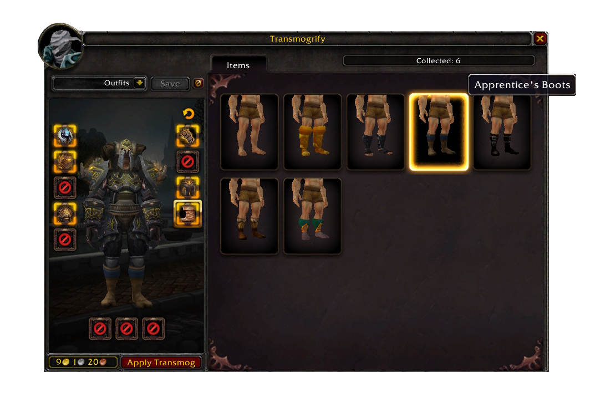

# mod-transmog-plus

Slot-based transmogrification module for [AzerothCore](https://github.com/azerothcore/azerothcore-wotlk).
Appearances are stored per slot (not per item), so your look stays when you swap gear.

## Features

- Slot-based transmog -- appearances stay on the equipment slot when you swap gear.
- Account-wide collection -- any appearance unlocked by one character is available account-wide.
- Appearances unlock when you equip an item.
- Option to hide individual armor slots (helm, shoulders, chest, etc.).

## Optional Addon (WIP)

This module includes a WoW 3.3.5a client addon in the `addon/` directory. It provides a
visual transmog interface with 3D item preview. If the addon is not installed, the standard
gossip menu is used as a fallback.

Known addon issues:
- Icon glow border for pending transmog slots not working.

## Installation

1. Place the module under the `modules/` folder of your AzerothCore source directory.
2. Re-run CMake and build.
3. Copy `conf/mod_transmog_plus.conf.dist` to `mod_transmog_plus.conf` and adjust as needed.
4. Import the SQL files manually, or let AzerothCore auto-import them on next server start.
5. Spawn the Transmog NPC in-game: `.npc add 190012`

Addon installation (optional): copy the `addon/Transmog/` folder to your client's
`Interface/AddOns/` directory.

## Configuration

All prices, quality restrictions, type rules, and requirement ignores are configurable in
`mod_transmog_plus.conf`. See the distributed config file for details.

## Known Limitations

- **Hidden appearance**: When a slot is hidden, its character-sheet icon turns invisible
  instead of showing a special icon. This happens because a fake item entry number is used
  to represent the hidden state, which is necessary for proper equipment refresh.
- **Set bonus counter**: Transmogging an item that belongs to an equipment set causes the
  client to show an incorrect set count (e.g. 5/6 instead of 6/6). The set bonus still
  functions correctly -- this is a display-only issue in the character sheet.

## Credits

- [flekz-games](https://github.com/flekz-games) for [cmangos-transmog](https://github.com/flekz-games/cmangos-transmog)
- [malinmr](https://github.com/malinmr) for porting the addon to AzerothCore

## License

GNU Affero General Public License v3 -- see `LICENSE`.
